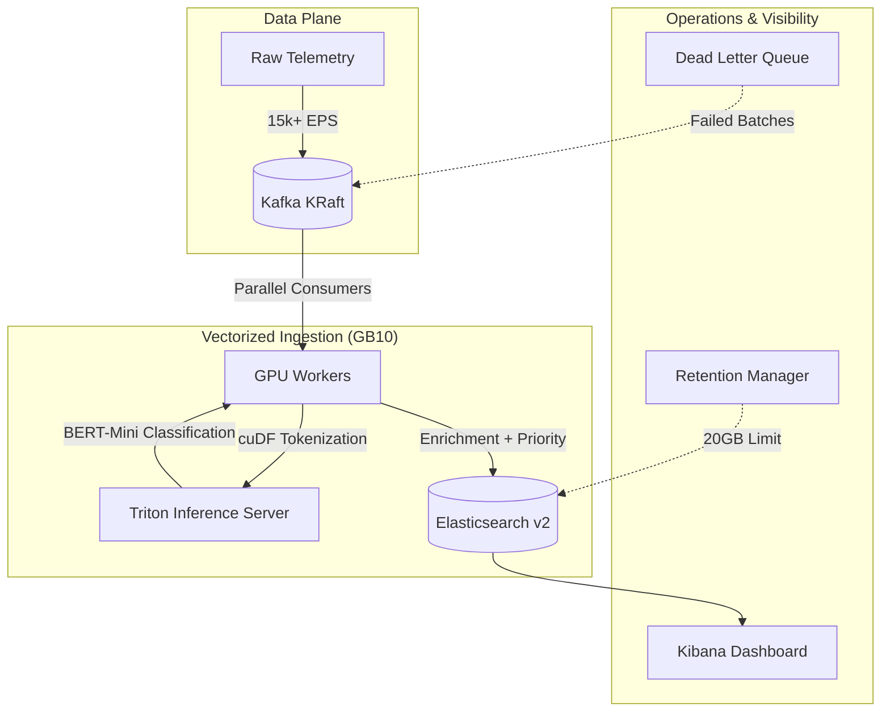

# 🏆 NVIDIA Blackwell SIEM: "Gold" Hardened Pipeline
### 21,300+ EPS | GPU-Native AI Detection | KRaft Modernized

A production-hardened SIEM pipeline optimized for **NVIDIA GB10 (Blackwell)** using **Morpheus 25.06**, **Triton Inference Server**, **Kafka KRaft**, and **Elasticsearch**.

This project is designed to show how a GPU-native SIEM can ingest, classify, enrich, and index security telemetry at high speed while keeping detection latency low. Instead of relying only on CPU parsing and regex-heavy rules, the pipeline performs **active AI detection during ingestion**, so logs are analyzed as they move through the pipeline rather than waiting in storage for later correlation.

---

## Why this project matters

Traditional SIEM stacks are strong at log collection and search, but they often become expensive and slow when event volume rises. As throughput grows, CPU-bound parsing, regex evaluation, and downstream indexing can introduce queueing delays.

This project demonstrates a different model:
- **GPU-native ingestion and preprocessing**
- **Real-time AI classification with BERT**
- **Modern Kafka in KRaft mode**
- **Authenticated, sharded Elasticsearch storage**
- **Operational hardening with DLQ, healthchecks, and retention controls**

The goal is simple: **faster detection, higher throughput, and simpler scale-up on a single Blackwell node**.

---

## Benefits over traditional SIEM

### Traditional SIEM
Traditional SIEM platforms usually depend on CPU scaling, parser chains, regex extraction, and post-ingestion correlation. That works well for many environments, but it can struggle when traffic spikes or when semantic detection is required.

Common trade-offs:
- Lower throughput per node
- Higher detection latency under sustained load
- More infrastructure required to scale
- Limited understanding of semantic intent in raw log text

### Blackwell Gold SIEM
This architecture shifts the expensive detection path onto the GPU and performs classification while the data is still moving through the ingestion pipeline.

Key advantages:
- **Active detection during ingestion**  
  Logs are not just collected and stored; they are tokenized, classified, and enriched before indexing.

- **Semantic analysis, not only pattern matching**  
  The pipeline uses **BERT-Mini** to detect intent and meaning, which helps with threats that are harder to catch using static rules alone.

- **Low detection delay**  
  Alerts can be generated close to the ingestion path instead of waiting for delayed search jobs or scheduled correlation.

- **Higher throughput on one node**  
  GPU parallelism allows the system to handle large event volumes without scaling out a large CPU fleet.

- **Operational resilience**  
  KRaft removes ZooKeeper, the DLQ protects failed records, and retention enforcement keeps storage bounded.

---

## What “active detection” means

In many traditional pipelines, logs are first collected, parsed, stored, and only then searched or correlated. In this project, detection happens **inside the ingestion flow**:

1. Logs enter Kafka.
2. Workers consume them in parallel.
3. The GPU tokenizes and prepares batches.
4. Triton runs BERT inference.
5. The pipeline enriches results with scores and metadata.
6. Incidents are indexed into Elasticsearch.

That means the pipeline is not just a storage path. It is an **active detection engine**.

---

## Current architecture



### Component summary

- **Kafka (KRaft mode)**  
  Entry point for high-throughput telemetry ingestion without ZooKeeper.

- **GPU workers**  
  Consume messages in parallel, batch them, and send them through the AI path.

- **Triton Inference Server**  
  Runs the BERT-Mini model with dynamic batching for high GPU utilization.

- **Elasticsearch v2 (8 shards)**  
  Stores incidents and supports fast indexing plus dashboard queries.

- **Kibana**  
  Provides analyst-facing search and dashboard visibility.

- **Retention worker**  
  Keeps storage within the configured volume limit.

- **DLQ (`morpheus_failed_logs`)**  
  Preserves failed batches instead of silently dropping them.

---

## Key features

- **Triton dual-instance configuration** for higher GPU concurrency
- **Dynamic batching** to reduce inference queue overhead
- **Kafka KRaft mode** for a simpler and more modern broker setup
- **Dead Letter Queue (DLQ)** for safer error handling
- **8-shard Elasticsearch index** for improved indexing throughput
- **Basic authentication** across the storage plane
- **Retention enforcement** to cap disk growth
- **Healthchecks** for service reliability and restart safety

---

## Quick start

### 1. Prerequisites
- NVIDIA GB10 / Blackwell-capable host
- NVIDIA Container Toolkit
- Docker Compose v2.20+
- Sufficient RAM / disk for Elasticsearch and benchmarks

### 2. Clone the repository
```bash
git clone https://github.com/madhivanan27/DGX-Spark-Blackwell-SIEM.git
cd DGX-Spark-Blackwell-SIEM
```

### 3. Initialize storage
```bash
./v2_GOLD_RESTORE.sh
```

### 4. Launch the stack
```bash
docker compose up -d
```

### 5. Verify health
```bash
docker compose ps
```

Expected services:
- kafka
- elasticsearch
- triton-morpheus
- kibana
- morpheus

### 6. Run a stress test
```bash
./stress_test/run_5min_test.sh
```

### 7. Monitor live throughput
```bash
docker compose logs morpheus -f | grep "EPS"
```

---

## Benchmarks

### Verified sustained profile
| Metric | Result |
| :--- | :--- |
| Max Throughput | 21,300+ EPS |
| Sustained Throughput | 13,800+ EPS |
| AI Inference Latency | 2.9 - 3.2 seconds |
| Total Ingested (30 min) | 3.79 million incidents |
| CPU Utilization | ~15% host average |
| GPU Utilization | High / near saturation |
| DLQ Reroutes | 0 during final sustained test |

### Interpretation
- **Burst throughput** shows the ceiling the system can reach.
- **Sustained throughput** shows the stable long-run production baseline.
- **Inference latency** shows how quickly the AI stage completes under load.
- **DLQ = 0** indicates clean processing during the validated run.

---

## Security and access

Use environment variables or a local `.env` file for credentials in real deployments.

Example:
```bash
ELASTIC_USER=elastic
ELASTIC_PASSWORD=change-me
```

Do not publish real credentials in a public repository.

---

## Who this is for

This project is useful for:
- SOC engineers evaluating GPU-native SIEM pipelines
- Security architects testing AI-assisted detection at ingestion time
- Platform engineers building high-throughput telemetry systems
- Teams exploring Morpheus + Triton + Elasticsearch on Blackwell

---

## License

Licensed under the **MIT License**.

---

## Notes

This repository focuses on a **single-node Blackwell reference architecture** that demonstrates how active AI detection can be embedded directly into the ingestion path. Blackwell is designed for high-throughput AI workloads, and modern AI-oriented SIEM approaches increasingly emphasize real-time analysis and semantic detection rather than relying only on traditional static parsing and delayed correlation.
